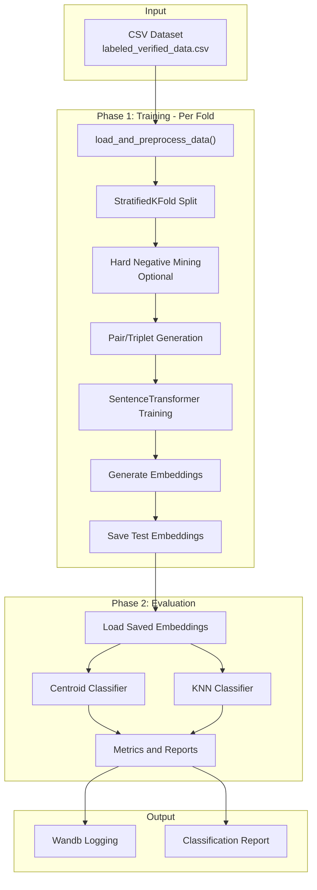
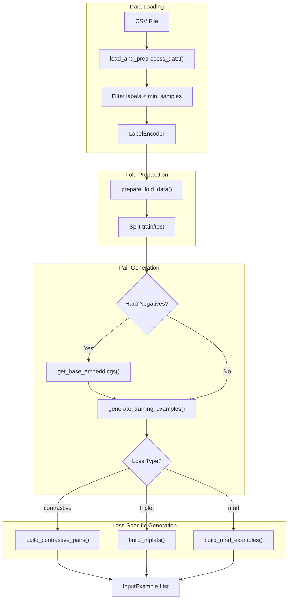
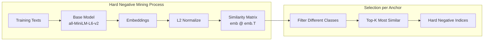
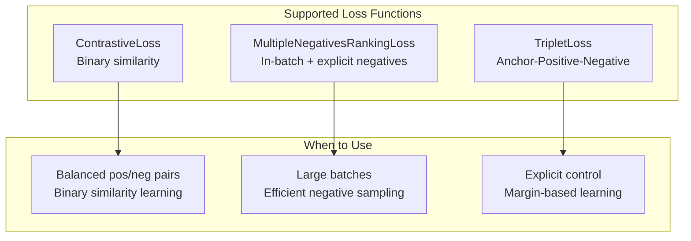
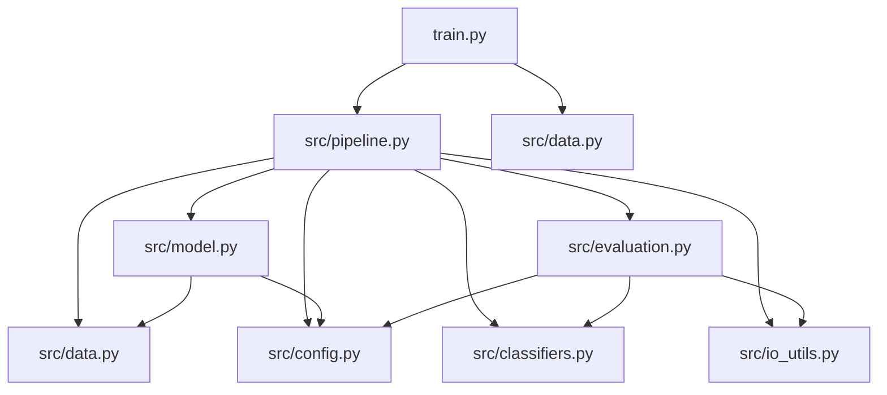

# Training Pipeline Documentation

This document describes the contrastive learning training pipeline for code classification using supervised contrastive embedding learning.

## Table of Contents

1. [Overview](#overview)
2. [High-Level Architecture](#high-level-architecture)
3. [Configuration Reference](#configuration-reference)
4. [Data Generation Flow](#data-generation-flow)
5. [Hard Negative Mining](#hard-negative-mining)
6. [Loss Functions](#loss-functions)
7. [Module Reference](#module-reference)
8. [Wandb Logging](#wandb-logging)

---

## Overview

The training pipeline implements a **two-phase 5-fold cross-validation** approach for learning text embeddings optimized for classification tasks.

### Entry Point

```
train.py -> run_5fold_cv() [src/pipeline.py]
```

### Two Phases

| Phase | Purpose | Output |
|-------|---------|--------|
| **Phase 1** | Train embedding model with contrastive loss | Embeddings for test samples |
| **Phase 2** | Evaluate embeddings with classifiers | Accuracy, F1, confusion matrix |

---

## High-Level Architecture



### Execution Flow

1. **Data Loading**: Load CSV, filter labels with insufficient samples, encode labels
2. **5-Fold CV**: Split data using StratifiedKFold for balanced class distribution
3. **Per Fold**:
   - Generate training pairs/triplets based on selected loss function
   - Optionally mine hard negatives using a base model
   - Train SentenceTransformer with contrastive loss
   - Generate embeddings for train and test sets
   - Evaluate with centroid classifier (Phase 1 quick check)
   - Save test embeddings
4. **Phase 2 Evaluation**: Re-evaluate all saved embeddings with both Centroid and KNN classifiers

---

## Configuration Reference

All configuration is done in `train.py`:

### Loss Function Settings

| Parameter | Type | Default | Description |
|-----------|------|---------|-------------|
| `LOSS_TYPE` | str | `"mnrl"` | Loss function: `"contrastive"`, `"mnrl"`, or `"triplet"` |
| `LOSS_MARGIN` | float | `0.5` | Margin for ContrastiveLoss and TripletLoss |

### Hard Negative Mining Settings

| Parameter | Type | Default | Description |
|-----------|------|---------|-------------|
| `USE_HARD_NEGATIVES` | bool | `True` | Enable hard negative mining |
| `NUM_HARD_NEGATIVES` | int | `3` | Number of hard negatives per anchor |
| `HN_BASE_MODEL` | str | `"all-MiniLM-L6-v2"` | Model for generating embeddings for mining |

### Model and Training Settings

| Parameter | Type | Default | Description |
|-----------|------|---------|-------------|
| `MODEL_NAME` | str | `"microsoft/Phi-3.5-mini-instruct"` | HuggingFace model identifier |
| `EPOCHS` | int | `3` | Training epochs per fold |
| `BATCH_SIZE` | int | `8` | Training batch size |
| `LEARNING_RATE` | float | `2e-5` | Learning rate |
| `WARMUP_STEPS` | int | `10` | LR warmup steps |
| `MAX_PAIRS_PER_CLASS` | int | `1000` | Maximum training pairs per class |
| `MAX_SEQ_LENGTH` | int | `768` | Maximum token sequence length |
| `SEED` | int | `42` | Random seed for reproducibility |
| `DENSE_DIM` | int | `8` | Output dimension for projection head |

### Example Configuration

```python
# Loss function
LOSS_TYPE = "mnrl"
LOSS_MARGIN = 0.5

# Hard negative mining
USE_HARD_NEGATIVES = True
NUM_HARD_NEGATIVES = 3
HN_BASE_MODEL = "all-MiniLM-L6-v2"

# Model
MODEL_NAME = "microsoft/Phi-3.5-mini-instruct"
EPOCHS = 3
BATCH_SIZE = 8
```

---

## Data Generation Flow



### Loss-Specific Data Formats

Each loss function requires a different data format:

#### ContrastiveLoss

Pairs with similarity labels (0 = dissimilar, 1 = similar):

```python
InputExample(texts=["text1", "text2"], label=1.0)  # Same class
InputExample(texts=["text1", "text3"], label=0.0)  # Different class
```

#### MultipleNegativesRankingLoss (MNRL)

Anchor-positive pairs, optionally with explicit negatives:

```python
# Without hard negatives (uses in-batch negatives)
InputExample(texts=["anchor", "positive"])

# With hard negatives
InputExample(texts=["anchor", "positive", "neg1", "neg2", "neg3"])
```

#### TripletLoss

Explicit (anchor, positive, negative) triplets:

```python
InputExample(texts=["anchor", "positive", "negative"])
```

### Data Format Summary

| Loss Type | Format | Hard Neg Usage |
|-----------|--------|----------------|
| `contrastive` | `(text1, text2, label)` | Hard negs become dissimilar pairs |
| `mnrl` | `(anchor, positive, [neg1, neg2, ...])` | Appended as explicit negatives |
| `triplet` | `(anchor, positive, negative)` | First hard neg used as negative |

---

## Hard Negative Mining

Hard negatives are samples from **different classes** that are **most similar** to the anchor in embedding space. They are "hard" because they are difficult to distinguish from positives.



### Mining Algorithm

```python
def mine_hard_negatives(texts, labels, embeddings, num_hard_negatives):
    # 1. Normalize embeddings for cosine similarity
    normalized = embeddings / norm(embeddings)
    
    # 2. Compute full similarity matrix
    similarity_matrix = normalized @ normalized.T
    
    # 3. For each anchor:
    for idx in range(n_samples):
        # Get samples from different classes
        different_class_mask = labels != labels[idx]
        
        # Get top-k most similar (hardest negatives)
        similarities = similarity_matrix[idx, different_class_mask]
        hard_neg_indices = argsort(similarities)[-k:][::-1]
```

### Why Hard Negatives?

| Approach | Pros | Cons |
|----------|------|------|
| Random Negatives | Fast, simple | May be too easy |
| Hard Negatives | More informative gradients | Requires pre-encoding |
| In-batch Negatives (MNRL) | Efficient | Limited to batch diversity |

---

## Loss Functions



### Loss Function Details

#### ContrastiveLoss

```python
losses.ContrastiveLoss(model=model, margin=0.5)
```

- **Input**: Pairs with labels (0/1)
- **Objective**: Pull similar pairs close, push dissimilar pairs apart by margin
- **Formula**: `L = y * d^2 + (1-y) * max(0, margin - d)^2`

#### MultipleNegativesRankingLoss (MNRL)

```python
losses.MultipleNegativesRankingLoss(model=model)
```

- **Input**: (anchor, positive) or (anchor, positive, neg1, neg2, ...)
- **Objective**: Rank positive higher than all negatives
- **Key Feature**: Uses all other batch positives as implicit negatives

#### TripletLoss

```python
losses.TripletLoss(model=model, triplet_margin=0.5)
```

- **Input**: (anchor, positive, negative)
- **Objective**: Distance to positive < distance to negative by margin
- **Formula**: `L = max(0, d(a,p) - d(a,n) + margin)`

---

## Module Reference

### Core Modules

| Module | Purpose | Key Functions |
|--------|---------|---------------|
| `train.py` | Entry point and configuration | `main()` |
| `src/pipeline.py` | Training orchestration | `run_5fold_cv()`, `init_wandb()` |
| `src/data.py` | Data loading and pair generation | `load_and_preprocess_data()`, `prepare_fold_data()`, `generate_training_examples()` |
| `src/model.py` | Model training and inference | `train_model()`, `get_loss_function()`, `encode_in_batches()` |

### Support Modules

| Module | Purpose | Key Functions |
|--------|---------|---------------|
| `src/classifiers.py` | Embedding-space classifiers | `build_centroids()`, `predict_centroid()`, `train_and_classify_knn()` |
| `src/evaluation.py` | Metrics and reporting | `evaluate_saved_embeddings_5fold()` |
| `src/io_utils.py` | Embedding I/O | `save_fold_embeddings()`, `load_saved_embeddings()` |
| `src/config.py` | Utilities | `set_seed()`, `clear_memory()` |

### Module Dependency Graph



---

## Wandb Logging

### Run Naming Convention

```
{model}-{loss_type}-{hn_status}-{seq_length}
```

Example: `Phi-3.5-mini-instruct-mnrl-hn-768`

### Tags

The pipeline automatically generates tags for filtering runs:

| Tag Type | Examples |
|----------|----------|
| Model | `model:Phi-3.5-mini-instruct`, `model:bert-base-uncased` |
| Loss | `loss:contrastive`, `loss:mnrl`, `loss:triplet` |
| Hard Negatives | `hard-negatives` or `no-hard-negatives`, `hn:3` |
| Training | `epochs:3`, `bs:8`, `seq:768` |
| Folds | `folds:5` |

### Logged Metrics

| Phase | Metric | Description |
|-------|--------|-------------|
| Phase 1 | `phase1_fold{N}_centroid_acc` | Per-fold centroid accuracy |
| Phase 1 | `phase1_fold{N}_centroid_f1` | Per-fold centroid F1 |
| Phase 2 | `phase2_centroid_report` | Full classification report table |
| Phase 2 | `phase2_centroid_confusion` | Confusion matrix |
| Phase 2 | `phase2_knn_report` | KNN classification report table |
| Phase 2 | `phase2_knn_confusion` | KNN confusion matrix |

---

## Quick Start

```bash
# 1. Install dependencies
pip install -r requirements.txt

# 2. Configure train.py (edit parameters as needed)

# 3. Run training
python train.py
```

### Minimal Configuration Changes

```python
# For quick experiments, modify these in train.py:
LOSS_TYPE = "mnrl"           # Try different loss functions
USE_HARD_NEGATIVES = True    # Toggle hard negative mining
MODEL_NAME = "all-MiniLM-L6-v2"  # Use smaller model for testing
EPOCHS = 1                   # Reduce for quick tests
```
